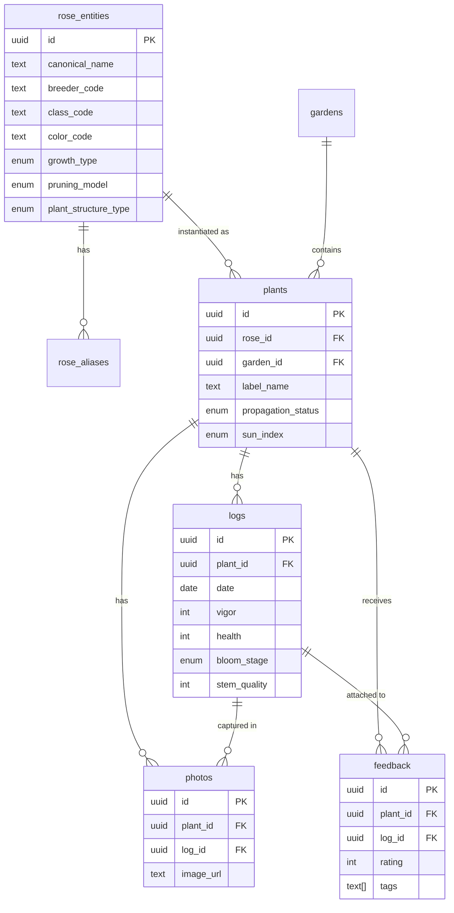

# Rosarium — Data Architecture

> Last updated: 2026-07-08
> Stack: Next.js 14 · Supabase (PostgreSQL + Storage) · TypeScript · Zustand

---

## 1. Database Schema

### Migrations
| File | Purpose |
|------|---------|
| `supabase/001_initial.sql` | All tables, indexes, RLS stubs |
| `supabase/002_seed.sql` | 7 gardens, 33 rose entities, aliases, ~50 plant instances |
| `supabase/003_propagation.sql` | Adds `propagation_status` + `propagation_notes` to `plants` |
| `supabase/004_rose_metadata.sql` | Adds `country_of_origin` to `rose_entities` |
| `supabase/005_rose_catalog.sql` | 120 additional rose varieties with full metadata |
| `supabase/006_backfill_origin.sql` | Sets `country_of_origin` on original 33 seed roses |
| `supabase/007_propagation_batches.sql` | `propagation_batches` + `propagation_batch_updates` tables |

### Tables

#### `rose_entities` — canonical rose catalog (shared, no auth)
| Column | Type | Notes |
|--------|------|-------|
| id | uuid PK | gen_random_uuid() |
| canonical_name | text UNIQUE NOT NULL | Official name |
| ars_registration_name | text | ARS formal name |
| breeder_code | text | e.g. JAC, WEK, KOR |
| class_code | text | e.g. HT, F, Cl HT |
| color_code | text | ARS color codes (ob, dr, mp…) |
| growth_type | enum | hybrid_tea \| floribunda \| climber \| shrub \| polyantha \| grandiflora \| miniature \| old_garden |
| pruning_model | enum | NEW_GROWTH_DOMINANT \| MIXED_CANE \| OLD_WOOD_SENSITIVE |
| plant_structure_type | enum DEFAULT 'cane' | cane \| stem_cluster \| vine_runner \| woody_branch |
| year_introduced | int | |
| species | text DEFAULT 'Rosa x hybrida' | |
| notes | text | |
| country_of_origin | text | Added migration 004. Displayed on plant detail page. |
| created_at | timestamptz | |

#### `rose_aliases` — trade/nursery/common names
| Column | Type | Notes |
|--------|------|-------|
| id | uuid PK | |
| rose_id | uuid FK → rose_entities | CASCADE delete |
| alias | text NOT NULL | |
| alias_type | enum | trade \| nursery \| common \| mislabel |
| confidence | float DEFAULT 1.0 | Used by resolveRose() |

Index: `idx_rose_aliases_rose_id`

#### `gardens` — named growing areas
| Column | Type | Notes |
|--------|------|-------|
| id | uuid PK | |
| name | text NOT NULL | |
| description | text | |
| location_notes | text | |
| sun_index | enum | EARLY_SOFT \| MID_BALANCED \| LATE_INTENSE |
| user_id | uuid | Reserved for Phase 2 auth |
| created_at | timestamptz | |

Seeded: North Wall, East Fence, Front Garden, Climbers, Sophie's Garden, Saul's Garden, Back Patio

#### `plants` — individual plant instances
| Column | Type | Notes |
|--------|------|-------|
| id | uuid PK | |
| rose_id | uuid FK → rose_entities | Nullable — allows unidentified plants |
| garden_id | uuid FK → gardens | Nullable |
| label_name | text NOT NULL | Display name (may differ from canonical) |
| position_index | int | Left-to-right within garden |
| date_planted | date | |
| notes | text | |
| sun_index | enum | Overrides garden default per-plant |
| user_id | uuid | Reserved for Phase 2 auth |
| created_at | timestamptz | |
| propagation_status | enum DEFAULT 'none' | none \| cutting_taken \| propagated — added 003 |
| propagation_notes | text | Free text, added 003 |

Indexes: `idx_plants_garden_id`, `idx_plants_rose_id`, `idx_plants_propagation_status`

#### `propagation_batches` — cutting batch records per plant
| Column | Type | Notes |
|--------|------|-------|
| id | uuid PK | |
| parent_plant_id | uuid FK → plants | CASCADE delete |
| batch_code | text NOT NULL | Short printable tag code e.g. `VOO-0708` (auto-generated) |
| date_taken | date NOT NULL | Default current_date |
| initial_count | int NOT NULL | Number of cuttings taken |
| notes | text | |
| status | enum DEFAULT 'active' | active \| complete \| abandoned |
| created_at | timestamptz | |

Indexes: `idx_prop_batches_plant`, `idx_prop_batches_status`

#### `propagation_batch_updates` — viability log per batch
| Column | Type | Notes |
|--------|------|-------|
| id | uuid PK | |
| batch_id | uuid FK → propagation_batches | CASCADE delete |
| update_date | date NOT NULL | |
| viable_count | int | Cuttings still alive |
| failed_count | int | Removed as dead |
| rooted_count | int | Confirmed rooted with new growth |
| notes | text | |
| created_at | timestamptz | |

Index: `idx_prop_batch_updates_batch`

#### `logs` — append-only weekly performance records
| Column | Type | Notes |
|--------|------|-------|
| id | uuid PK | |
| plant_id | uuid FK → plants | CASCADE delete |
| date | date NOT NULL DEFAULT current_date | |
| vigor | int 1–5 | Overall plant energy |
| health | int 1–5 | Disease/pest/structural health |
| bloom_stage | enum | dormant \| budding \| bud \| half_open \| open \| fully_open \| spent \| hip_forming |
| stem_quality | int 1–5 | Exhibition cut-flower quality |
| notes | text | |
| created_at | timestamptz | |

Indexes: `idx_logs_plant_id`, `idx_logs_date`

#### `photos` — Supabase Storage refs
| Column | Type | Notes |
|--------|------|-------|
| id | uuid PK | |
| plant_id | uuid FK → plants | CASCADE delete |
| log_id | uuid FK → logs | SET NULL on delete |
| image_url | text NOT NULL | Public URL from `rosarium-photos` bucket |
| taken_at | timestamptz DEFAULT now() | |
| notes | text | |

Storage path pattern: `plants/{plant_id}/{timestamp}.{ext}`
Index: `idx_photos_plant_id`

#### `feedback` — public observations (no auth)
| Column | Type | Notes |
|--------|------|-------|
| id | uuid PK | |
| plant_id | uuid FK → plants | CASCADE delete |
| log_id | uuid FK → logs | SET NULL on delete |
| author_name | text | Optional |
| rating | int 1–5 | |
| tags | text[] DEFAULT '{}' | structure \| health \| bloom_quality \| airflow \| pruning_suggestion \| color \| fragrance \| disease |
| comment | text | |
| honeypot | text | Bot trap — ignored if non-null |
| created_at | timestamptz | |

Index: `idx_feedback_plant_id`

---

## 2. Entity Relationship Diagram



---

## 3. TypeScript Type System (`src/types/schema.ts`)

### Primitive enums
| Type | Values |
|------|--------|
| `GrowthType` | hybrid_tea \| floribunda \| climber \| shrub \| polyantha \| grandiflora \| miniature \| old_garden |
| `PruningModel` | NEW_GROWTH_DOMINANT \| MIXED_CANE \| OLD_WOOD_SENSITIVE |
| `SunIndex` | EARLY_SOFT \| MID_BALANCED \| LATE_INTENSE |
| `BloomStage` | dormant \| budding \| bud \| half_open \| open \| fully_open \| spent \| hip_forming |
| `AliasType` | trade \| nursery \| common \| mislabel |
| `PlantStructureType` | cane \| stem_cluster \| vine_runner \| woody_branch |
| `PropagationStatus` | none \| cutting_taken \| propagated |
| `BatchStatus` | active \| complete \| abandoned |
| `FeedbackTag` | structure \| health \| bloom_quality \| airflow \| pruning_suggestion \| color \| fragrance \| disease |

### Core interfaces
```
RoseEntity          ← maps rose_entities table (incl. country_of_origin)
RoseAlias           ← maps rose_aliases table
Garden              ← maps gardens table
Plant               ← maps plants table (propagation_status/notes optional for backward compat)
Log                 ← maps logs table
Photo               ← maps photos table
Feedback            ← maps feedback table
PropagationBatch    ← maps propagation_batches table (with optional parent_plant join)
PropagationBatchUpdate ← maps propagation_batch_updates table
```

### Derived / computed types
```
PlantWithDetails extends Plant {
  rose_entity: RoseEntity   ← joined via Supabase .select('*, rose_entity:rose_entities(*)')
  garden: Garden            ← joined via .select('*, garden:gardens(*)')
  latest_log?: Log          ← not from DB; computed in getPlants() or hydrated by Zustand
  log_count?: number        ← same
}

AnalyticsData {
  plant_id, label_name, canonical_name
  avg_vigor, avg_health        ← computed from logs in analytics.ts
  log_count
  last_log_date
  avg_bloom_interval_days      ← days between 'open'/'fully_open' bloom entries
}
```

---

## 4. Query Layer (`src/lib/queries.ts`)

All functions use the lazy Supabase singleton from `src/lib/supabase.ts`.

| Function | Table(s) | Notes |
|----------|----------|-------|
| `getPlants()` | plants + logs + rose_entities + gardens | Returns `PlantWithDetails[]` with `latest_log` and `log_count` hydrated from a second parallel logs query |
| `getPlant(id)` | plants + rose_entities + gardens | Single plant, null if not found |
| `createPlant(plant)` | plants | Inserts, returns full row |
| `updatePlant(id, updates)` | plants | Partial update |
| `getLogsByPlant(plantId)` | logs | Descending by date |
| `createLog(log)` | logs | Inserts, returns full row including id |
| `getPhotosByPlant(plantId)` | photos | Descending by taken_at |
| `createPhoto(photo)` | photos | Inserts |
| `uploadPhoto(plantId, file)` | storage: rosarium-photos | Uploads to `plants/{id}/{ts}.{ext}`, returns public URL |
| `getFeedbackByPlant(plantId)` | feedback | Descending by created_at |
| `createFeedback(feedback)` | feedback | Inserts |
| `getRoseEntities()` | rose_entities + rose_aliases | Full catalog |
| `getGardens()` | gardens | Ordered by name |
| `getGardensWithCounts()` | gardens + plants | Joins plant count per garden in JS |
| `createPropagationBatch(batch)` | propagation_batches | Inserts batch record |
| `getActiveBatches()` | propagation_batches + plants + rose_entities + batch_updates | All `status = 'active'` batches with parent plant info |
| `getBatchesByPlant(plantId)` | propagation_batches + batch_updates | All batches for one plant |
| `addBatchUpdate(update)` | propagation_batch_updates | Inserts a viability snapshot |
| `updateBatchStatus(batchId, status)` | propagation_batches | Mark active/complete/abandoned |

---

## 5. Analytics Layer (`src/lib/analytics.ts`)

All computations are in-memory after fetching raw rows. No SQL aggregations.

### `getPlantAnalytics(): Promise<AnalyticsData[]>`
1. Fetch all plants (`id`, `label_name`, `canonical_name` via join)
2. Fetch all logs (`plant_id`, `date`, `vigor`, `health`, `bloom_stage`)
3. Group logs by `plant_id`
4. For each plant compute:
   - `avg_vigor` = mean of non-null vigor values
   - `avg_health` = mean of non-null health values
   - `avg_bloom_interval_days` = mean gap in days between `open`/`fully_open` log entries (requires ≥2 bloom dates)
   - `log_count` = total log rows
   - `last_log_date` = most recent log date

### `getTopPerformers(limit)` 
Filters to plants with `log_count > 0`, sorts by `avg_vigor + avg_health` descending.

### `getNeedsAttention(daysSinceLog = 9)`
Returns plants where `last_log_date` is older than the cutoff, or has no logs at all.

---

## 6. Rose Identity Resolver (`src/lib/resolveRose.ts`)

### `resolveRose(input): Promise<ResolveResult[]>`
Used in the Add Plant form for live rose lookup as the user types.

Algorithm:
1. Fetch all `rose_entities` with embedded `rose_aliases`
2. For each entity, check if `canonical_name.includes(input)` → confidence 0.85 (1.0 if exact)
3. Else check each alias → confidence 0.75 (0.95 if exact)
4. Return top 5 results sorted by confidence descending

```
ResolveResult {
  entity: RoseEntity
  matched_alias: string | null
  confidence: number          // 0.75 – 1.0
}
```

---

## 7. API Routes

### `POST /api/feedback`
**File:** `src/app/api/feedback/route.ts`

Accepts: `{ plant_id, log_id?, author_name?, rating?, tags?, comment?, honeypot? }`

Guards:
- In-memory rate limiter: 5 requests / IP / hour
- Honeypot field: silently discards if non-empty
- Validates `plant_id` present

### `PATCH /api/propagation/[plantId]`
**File:** `src/app/api/propagation/[plantId]/route.ts`

Accepts: `{ status: PropagationStatus, notes?: string }`

Guards:
- Validates `status` is one of `['none', 'cutting_taken', 'propagated']`
- Returns 400 on invalid JSON or invalid status

Note: Propagation batch CRUD (`propagation_batches`, `propagation_batch_updates`) is done directly via the Supabase anon client from client components — no dedicated API routes needed.

---

## 8. State Management (`src/store/useStore.ts`)

Zustand store — used for optimistic UI and cross-component state sharing.

```
RosariumState {
  plants: PlantWithDetails[]
  gardens: Garden[]
  selectedPlantId: string | null
  quickAddOpen: boolean       ← shared between BottomNav (+) and QuickAddButton modal

  setPlants(plants)
  setGardens(gardens)
  setSelectedPlantId(id)
  openQuickAdd()             ← called by BottomNav FAB
  closeQuickAdd()            ← called by QuickAddButton on dismiss
  addLog(log)                ← updates latest_log and log_count on the matching plant
  addPhoto(_photo)           ← stub (no-op currently)
}
```

---

## 9. Route & Page Map

| Route | File | Render | Data Sources |
|-------|------|--------|--------------|
| `/` | `app/page.tsx` | Server | `getPlants()`, `getTopPerformers(5)`, `getNeedsAttention(9)` |
| `/plants` | `app/plants/page.tsx` | Server | `getPlants()`, `getGardens()`. Supports `?view=garden` (default) and `?view=type` |
| `/plants/add` | `app/plants/add/page.tsx` | Client | `getGardens()` (effect), `resolveRose()` (live), `createPlant()` |
| `/plants/[id]` | `app/plants/[id]/page.tsx` | Server | `getPlant()`, `getLogsByPlant()`, `getPhotosByPlant()`, `getFeedbackByPlant()` |
| `/log/[plantId]` | `app/log/[plantId]/page.tsx` | Server (shell) + Client (form) | `getPlant()` server-side; `createLog()`, `uploadPhoto()`, `createPhoto()` client-side |
| `/analytics` | `app/analytics/page.tsx` | Server | `getPlantAnalytics()`, `getTopPerformers(10)` |
| `/gardens` | `app/gardens/page.tsx` | Server | `getGardensWithCounts()`. Full CRUD via Supabase client in `GardenManager` |
| `/propagation` | `app/propagation/page.tsx` | Server | `plants` + `rose_entities` + `gardens` (custom query). Variety count computed in JS |
| `/propagation/batches` | `app/propagation/batches/page.tsx` | Server | `getActiveBatches()` with parent plant + update history |
| `/feedback/[plantId]` | `app/feedback/[plantId]/page.tsx` | Server (shell) + Client (form) | `getPlant()` server-side; `POST /api/feedback` client-side |
| `/offline` | `app/offline/page.tsx` | Client | Static fallback shown by service worker when offline |

---

## 10. Component → Data Dependency Map

```mermaid
graph TD
    A[app/page.tsx] --> Q1[getPlants]
    A --> Q2[getTopPerformers]
    A --> Q3[getNeedsAttention]

    B[app/plants/page.tsx] --> Q1
    B --> Q4[getGardens]

    C[app/plants/id/page.tsx] --> Q5[getPlant]
    C --> Q6[getLogsByPlant]
    C --> Q7[getPhotosByPlant]
    C --> Q8[getFeedbackByPlant]
    C --> CMP1[PlantAnalyticsStrip]
    C --> CMP2[PhotoGallery]
    C --> CMP3[LogTimeline]
    C --> CMP4[FeedbackPanel]
    C --> CMP5[ShareButton]
    C --> CMP6[ArsLabel]

    D[app/log/plantId/page.tsx] --> Q5
    D --> CMP7[LogForm]
    CMP7 --> Q9[createLog]
    CMP7 --> Q10[uploadPhoto]
    CMP7 --> Q11[createPhoto]
    CMP7 --> CMP8[PhotoUploader]

    E[app/propagation/page.tsx] --> DB[(Supabase direct)]
    E --> CMP9[PropagationChecklist]
    CMP9 --> API1[PATCH /api/propagation/plantId]

    F[app/feedback/plantId/page.tsx] --> Q5
    F --> CMP10[FeedbackForm]
    CMP10 --> API2[POST /api/feedback]

    G[app/analytics/page.tsx] --> Q12[getPlantAnalytics]
    G --> Q13[getTopPerformers]
    G --> CMP11[AnalyticsDashboard]

    CMP2 --> |logs prop| Q6
    CMP9 -.->|optimistic| STATE[Zustand Store]
```



---

## 11. Propagation Tracker — Data Flow

Added 2026-07-07. Enables pre-move cloning tracking.

```
DB: plants.propagation_status  (none | cutting_taken | propagated)
DB: plants.propagation_notes   (free text)

Server fetch (propagation/page.tsx):
  SELECT id, rose_id, label_name, propagation_status, propagation_notes,
         rose_entity:rose_entities(canonical_name),
         garden:gardens(name)
  → compute variety_count per rose_id in JS
  → split into critical (variety_count=1) vs standard (variety_count>1)

Client (PropagationChecklist.tsx):
  - Optimistic tap → PATCH /api/propagation/[plantId] { status }
  - Revert on fetch failure
  - Progress bar: propagated / total

Priority logic:
  variety_count = 1 → "Critical — Unique Specimens" (lose plant = lose variety)
  variety_count > 1 → "Standard — Multiple Specimens"
```

---

## 12. PWA Configuration

| File | Purpose |
|------|---------|
| `src/app/icon.tsx` | Generates 512×512 PNG icon via `ImageResponse`. Served at `/icon.png`. Used as favicon, home screen icon. |
| `src/app/manifest.ts` | Next.js App Router manifest → auto-injects `<link rel="manifest" href="/manifest.webmanifest">` |
| `next.config.js` | `experimental.allowedDevOrigins: ['192.168.0.117']` — permits phone access on local network without CORS warning |

Manifest values: `display: standalone`, `theme_color: #be185d`, `background_color: #fafafa`

---

## 13. Key Design Decisions

| Decision | Rationale |
|----------|-----------|
| `rose_entities` separate from `plants` | One canonical rose identity can have many plant instances across gardens. Enables cross-garden comparison and variety-level analytics. |
| `rose_aliases` table | Nurseries sell the same rose under different names (e.g. "Piñata" vs "Pinata Rose"). The resolver uses alias confidence scoring to match user input to canonical identity. |
| No auth in Phase 1 | Single-owner private URL. `user_id` columns exist on plants/photos/gardens/logs for RLS readiness when multi-tenant SaaS launches. |
| Feedback is always public | Club members submit via shared link with no login required. Honeypot + rate-limiting prevent abuse. |
| Append-only logs | Historical weekly records are immutable. Vigor/health trends are only meaningful over time. |
| In-memory analytics | Volume is small (~50 plants × ~52 logs/year = ~2600 rows). No materialized views needed until SaaS scale. |
| `propagation_status` on plants not rose_entities | Each plant instance may be at a different propagation stage (you might have 5 Blue Girls — each at a different cutting stage). |
| `variety_count` computed in JS | Avoids a window function query. At ~50 plants, a JS loop is trivially fast and simpler to reason about. |

---

## 14. Environment Variables

| Variable | Required | Description |
|----------|----------|-------------|
| `NEXT_PUBLIC_SUPABASE_URL` | Yes | Supabase project URL |
| `NEXT_PUBLIC_SUPABASE_ANON_KEY` | Yes | Supabase anonymous key (public, client-safe) |

Set in `.env.local` for development, Vercel environment settings for production.

---

## 15. External Services

| Service | Usage |
|---------|-------|
| Supabase PostgreSQL | Primary database |
| Supabase Storage (`rosarium-photos` bucket) | Photo uploads, public read |
| Vercel | Deployment, Edge functions for `ImageResponse` |
| Google Fonts (Inter) | Typography via `next/font` |